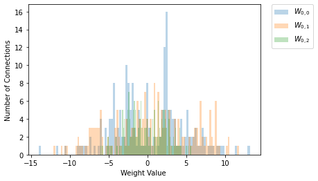
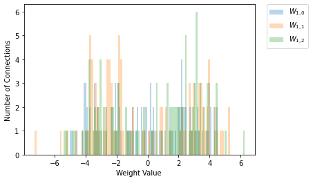

> This is a ReadMe template to help save you time and effort.

---

### Table of Contents
You're sections headers will be used to reference location of destination.

- [Description](#description)
- [How To Use](#how-to-use)
- [A Simple Example](#a-simple-example)
- [References](#references)
- [License](#license)

---

## Description

This project aims to observe the behavior from hidden layers, how the neural network adapts to solve problems proposed. More specically how it "chooses" node weights and what properties results that characterize each layer. \
Primarily a well-known example has been implemented, how classify handwritten numbers to typed numbers, in this kind of problem is necessary many nodes and layers this makes them difficult to observe the proprieties. \
Because of this we will analyze the networks trained to binary classification problems. The network has to classify two regions A (red) and B
(blue) separated by a barrier, where the barrier is given by a function, f. In that case topology techniques are used to obtain information on the deformations performed
by the ANNs in the initial dataset. 

 

    
    
## How To Use

#### Inputs
    
At main files you can edit all the parameters: \
**Neural Network**: a vector representing number of nodes per layer, epochs, learning rate and activation function (sigmoid, hyperbolic tangent and sine). \
**Training**: barrier function, training size and domain. \
**Testing**: training size and domain. \
**Graphic options**: resolution and number of runs.  
    
#### Outputs
 
 For bouth main files: \
   Loss function, fraction error, histogram weight. \
 Only for region classifier: \
    Precision error, classified area, hidden layer deformation. 
   
#### Requirements

* Python 3.8 
* Mlxtend
* Mnist 

## A Simple Example

In theory the neural network transforms a nonlinear problem into a linear problem. Let's test f(x)=|x| as a barrier function with 2 nodes in the hidden layer:  

 

    

In this case, it is difficult to observe the network strategy with the histograms:

  
   

Notice that the hidden layer received a linear problem:

 

    

## References
http://colah.github.io/posts/2014-03-NN-Manifolds-Topology/
---

## License

MIT License

Copyright (c) [2021] Igor Gusev 

Permission is hereby granted, free of charge, to any person obtaining a copy
of this software and associated documentation files (the "Software"), to deal
in the Software without restriction, including without limitation the rights
to use, copy, modify, merge, publish, distribute, sublicense, and/or sell
copies of the Software, and to permit persons to whom the Software is
furnished to do so, subject to the following conditions:

The above copyright notice and this permission notice shall be included in all
copies or substantial portions of the Software.

THE SOFTWARE IS PROVIDED "AS IS", WITHOUT WARRANTY OF ANY KIND, EXPRESS OR
IMPLIED, INCLUDING BUT NOT LIMITED TO THE WARRANTIES OF MERCHANTABILITY,
FITNESS FOR A PARTICULAR PURPOSE AND NONINFRINGEMENT. IN NO EVENT SHALL THE
AUTHORS OR COPYRIGHT HOLDERS BE LIABLE FOR ANY CLAIM, DAMAGES OR OTHER
LIABILITY, WHETHER IN AN ACTION OF CONTRACT, TORT OR OTHERWISE, ARISING FROM,
OUT OF OR IN CONNECTION WITH THE SOFTWARE OR THE USE OR OTHER DEALINGS IN THE
SOFTWARE.

[Back To The Top](#read-me-template)

---

[Back To The Top](#read-me-template)
